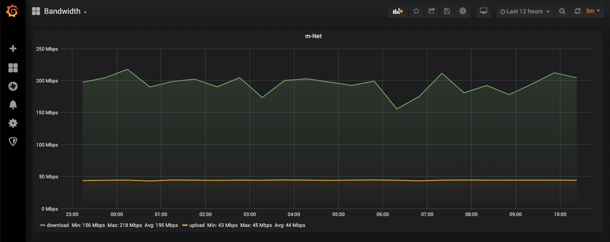

# Internet Speed Test in a Container

[](https://hub.docker.com/r/robinmanuelthiel/speedtest/)

Check your internet bandwidth using the [Speedtest CLI](https://www.speedtest.net/apps/cli) from a Docker container. You can configure the tool to run periodically and save the results to an InfluxDB for visualization or long-term records.

```bash
docker run --rm robinmanuelthiel/speedtest:latest
```

The result will then look like this:

```bash
Running a Speed Test...
Your download speed is 334 Mbps (29284399 Bytes/s).
Your upload speed is 42 Mbps (4012944 Bytes/s).
Your ping is 6.223 ms.
```

## Configuration

| Environment variable | Default value           | Description                       |
| -------------------- | ----------------------- | --------------------------------- |
| `LOOP`               | `false`                 | Run Speedtest in a loop           |
| `LOOP_DELAY`         | `60`                    | Delay in seconds between the runs |
| `DB_SAVE`            | `false`                 | Save values to InfluxDB           |
| `DB_HOST`            | `http://localhost:8086` | InfluxDB Hostname                 |
| `DB_NAME`            | `speedtest`             | InfluxDB Database name            |
| `DB_USERNAME`        | `admin`                 | InfluxDB Username                 |
| `DB_PASSWORD`        | `password`              | InfluxDB Password                 |

## Grafana and InfluxDB



For a full visualization and long term tracking, I recommend InfluxDB as a time-series database and Grafana as a dashboard engine. Both come in Docker containers, so the whole setup can be achieved by starting a Docker Compose file.

```yaml
version: "3"
services:
  grafana:
    image: grafana/grafana:7.5.2
    restart: always
    ports:
      - 3000:3000
    volumes:
      - grafana:/var/lib/grafana
    depends_on:
      - influxdb

  influxdb:
    image: influxdb:1.8.3
    volumes:
      - influxdb:/var/lib/influxdb
    ports:
      - 8083:8083
      - 8086:8086
    environment:
      - INFLUXDB_ADMIN_USER="admin"
      - INFLUXDB_ADMIN_PASSWORD="password"
      - INFLUXDB_DB="speedtest"

  speedtest:
    image: robinmanuelthiel/speedtest:latest
    environment:
      - LOOP=true
      - LOOP_DELAY=1800
      - DB_SAVE=true
      - DB_HOST=http://influxdb:8086
      - DB_NAME=speedtest
      - DB_USERNAME=admin
      - DB_PASSWORD=password
    privileged: true # Needed for 'sleep' in the loop
    depends_on:
      - influxdb

volumes:
  grafana:
  influxdb:
```

To configure Grafana, we need to add InfluxDB as a data source and create a dashboard with the upload and download values. You can find a demo dashboard configuration in the [/demo](/demo) folder.

> **Hint:** The speedtest outputs values as bytes per second. Make sure to divide all values by 125000 in your dashboard to get the Mbps values.
